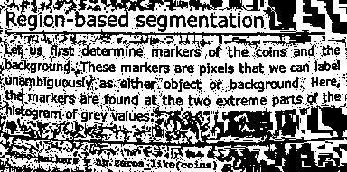

# ImageBinarization
[](https://travis-ci.com/zygmuntszpak/ImageBinarization.jl)
[](https://ci.appveyor.com/project/zygmuntszpak/ImageBinarization-jl)
[](https://codecov.io/gh/zygmuntszpak/ImageBinarization.jl)
[](https://zygmuntszpak.github.io/ImageBinarization.jl/stable)
[](https://zygmuntszpak.github.io/ImageBinarization.jl/dev)

A Julia package containing a number of algorithms for analyzing images and
automatically binarizing them into background and foreground.

A full list of algorithms can be found in the [documentation](https://zygmuntszpak.github.io/ImageBinarization.jl/stable).

The general usage pattern is:
```julia
imgb = binarize(algorithm::ThresholdAlgorithm, img)
```

<h2>Examples of ImageBinarization in action:</h2>
<h>Image of cells:</h>
<table width="500" border="0" cellpadding="5">

<tr>
<td align="center" valign="center">

<br />
Original image
</td>
</tr>

<tr>
<td align="center" valign="center">

<br />
Intermodes
</td>

<td align="center" valign="center">

<br />
Minimum Error
</td>

<td align="center" valign="center">

<br />
Minimum
</td>
</tr>

<tr>
<td align="center" valign="center">

<br />
Moments
</td>

<td align="center" valign="center">

<br />
Otsu
</td>

<td align="center" valign="center">

<br />
Polysegment
</td>
</tr>

<tr>
<td align="center" valign="center">

<br />
Rosin
</td>

<td align="center" valign="center">

<br />
Sauvola
</td>

<td align="center" valign="center">

<br />
Niblack
</td>
</tr>
</table>

<h>Image of moon surface: (Unimodal)</h>
<table width="500" border="0" cellpadding="5">

<tr>
<td align="center" valign="center">

<br />
Original image
</td>
</tr>

<tr>
<td align="center" valign="center">

<br />
Intermodes
</td>

<td align="center" valign="center">

<br />
Minimum Error
</td>

<td align="center" valign="center">

<br />
Minimum
</td>
</tr>

<tr>
<td align="center" valign="center">

<br />
Moments
</td>

<td align="center" valign="center">

<br />
Otsu
</td>

<td align="center" valign="center">

<br />
Polysegment
</td>
</tr>

<tr>
<td align="center" valign="center">

<br />
Rosin
</td>

<td align="center" valign="center">

<br />
Sauvola
</td>

<td align="center" valign="center">

<br />
Niblack
</td>
</tr>
</table>

<h>Image of text:</h>
<table width="500" border="0" cellpadding="5">

<tr>
<td align="center" valign="center">

<br />
Original image
</td>
</tr>

<tr>
<td align="center" valign="center">

<br />
Intermodes
</td>

<td align="center" valign="center">

<br />
Minimum Error
</td>

<td align="center" valign="center">

<br />
Minimum
</td>
</tr>

<tr>
<td align="center" valign="center">

<br />
Moments
</td>

<td align="center" valign="center">

<br />
Otsu
</td>

<td align="center" valign="center">

<br />
Polysegment
</td>
</tr>

<tr>
<td align="center" valign="center">

<br />
Rosin
</td>

<td align="center" valign="center">

<br />
Sauvola
</td>

<td align="center" valign="center">

<br />
Niblack
</td>
</tr>
</table>

## Example
Suppose one wants to binarize an image. This can be achieved by simply choosing
an appropriate algorithm and calling `binarize` in the image. The background
and foreground will be automatically binarized.

```julia
using ImageBinarization
using TestImages # For the cameraman image.

#load cameraman image
img = testimage("cameraman")

#binarize the image
imgb = binarize(Otsu(), img)
```
