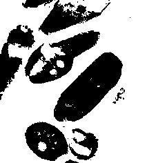

# ImageBinarization
[![][travis-img]][travis-url]
[![][appveyor-img]][appveyor-url]
[![][pkgeval-img]][pkgeval-url]
[![][codecov-img]][codecov-url]
[![][docs-stable-img]][docs-stable-url]
[![][docs-dev-img]][docs-dev-url]

A Julia package containing a number of algorithms for analyzing images and
automatically binarizing them into background and foreground.

In simple words, the general usage pattern of this package is:

```julia
imgb = binarize(img, algorithm::AbstractImageBinarizationAlgorithm)
```

For more detailed usage and a full list of algorithms, please check the [documentation][docs-stable-url].

## Examples of ImageBinarization in action

### Example: cells

<table width="500" border="0" cellpadding="5">

<tr>
<td align="center" valign="center">

<br />
Original image
</td>
</tr>

<tr>
<td align="center" valign="center">

<br />
Intermodes
</td>

<td align="center" valign="center">

<br />
Minimum Error
</td>

<td align="center" valign="center">

<br />
Minimum
</td>
</tr>

<tr>
<td align="center" valign="center">

<br />
Moments
</td>

<td align="center" valign="center">

<br />
Otsu
</td>

<td align="center" valign="center">

<br />
Polysegment
</td>
</tr>

<tr>
<td align="center" valign="center">

<br />
Rosin
</td>

<td align="center" valign="center">

<br />
Sauvola
</td>

<td align="center" valign="center">

<br />
Niblack
</td>
</tr>

<tr>
<td align="center" valign="center">

<br />
Adaptive
</td>

<td align="center" valign="center">

<br />
Yen
</td>

<td align="center" valign="center">

<br />
Balanced
</td>
</tr>
</table>

### Example: moon surface -- Unimodal

<table width="500" border="0" cellpadding="5">

<tr>
<td align="center" valign="center">

<br />
Original image
</td>
</tr>

<tr>
<td align="center" valign="center">

<br />
Intermodes
</td>

<td align="center" valign="center">

<br />
Minimum Error
</td>

<td align="center" valign="center">

<br />
Minimum
</td>
</tr>

<tr>
<td align="center" valign="center">

<br />
Moments
</td>

<td align="center" valign="center">

<br />
Otsu
</td>

<td align="center" valign="center">

<br />
Polysegment
</td>
</tr>

<tr>
<td align="center" valign="center">

<br />
Rosin
</td>

<td align="center" valign="center">

<br />
Sauvola
</td>

<td align="center" valign="center">

<br />
Niblack
</td>
</tr>

<tr>
<td align="center" valign="center">

<br />
Adaptive
</td>

<td align="center" valign="center">

<br />
Yen
</td>

<td align="center" valign="center">

<br />
Balanced
</td>
</tr>
</table>

### Example: text

<table width="500" border="0" cellpadding="5">

<tr>
<td align="center" valign="center">

<br />
Original image
</td>
</tr>

<tr>
<td align="center" valign="center">

<br />
Intermodes
</td>

<td align="center" valign="center">

<br />
Minimum Error
</td>

<td align="center" valign="center">

<br />
Minimum
</td>
</tr>

<tr>
<td align="center" valign="center">

<br />
Moments
</td>

<td align="center" valign="center">

<br />
Otsu
</td>

<td align="center" valign="center">

<br />
Polysegment
</td>
</tr>

<tr>
<td align="center" valign="center">

<br />
Rosin
</td>

<td align="center" valign="center">

<br />
Sauvola
</td>

<td align="center" valign="center">

<br />
Niblack
</td>
</tr>

<tr>
<td align="center" valign="center">

<br />
Adaptive
</td>

<td align="center" valign="center">

<br />
Yen
</td>

<td align="center" valign="center">

<br />
Balanced
</td>
</tr>
</table>

<!-- URLS -->

[pkgeval-img]: https://juliaci.github.io/NanosoldierReports/pkgeval_badges/I/ImageBinarization.svg
[pkgeval-url]: https://juliaci.github.io/NanosoldierReports/pkgeval_badges/report.html
[travis-img]: https://travis-ci.com/zygmuntszpak/ImageBinarization.jl.svg?branch=master
[travis-url]: https://travis-ci.com/zygmuntszpak/ImageBinarization.jl
[appveyor-img]: https://ci.appveyor.com/api/projects/status/github/zygmuntszpak/ImageBinarization.jl?svg=true
[appveyor-url]: https://ci.appveyor.com/project/zygmuntszpak/ImageBinarization-jl
[codecov-img]: https://codecov.io/gh/zygmuntszpak/ImageBinarization.jl/branch/master/graph/badge.svg
[codecov-url]: https://codecov.io/gh/zygmuntszpak/ImageBinarization.jl
[docs-stable-img]: https://img.shields.io/badge/docs-stable-blue.svg
[docs-stable-url]: https://zygmuntszpak.github.io/ImageBinarization.jl/stable
[docs-dev-img]: https://img.shields.io/badge/docs-dev-blue.svg
[docs-dev-url]: https://zygmuntszpak.github.io/ImageBinarization.jl/dev
