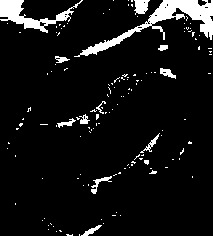
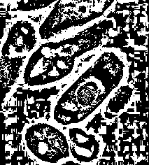
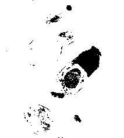
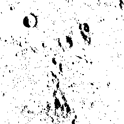
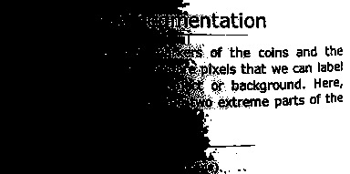

# ImageBinarization.jl Documentation

A Julia package containing a number of algorithms for analyzing images and
automatically binarizing them into background and foreground.

```@contents
Depth = 3
```

## Getting started
This package is part of a wider Julia-based image processing
[ecosystem](https://github.com/JuliaImages). If you are starting out, then you
may benefit from [reading](https://juliaimages.org/latest/quickstart/) about
some fundamental conventions that the ecosystem utilizes that are markedly
different from how images are typically represented in OpenCV, MATLAB, ImageJ or
Python.

The usage examples in the `ImageBinarization.jl` package assume that you have
already installed some key packages. Notably, the examples assume that you are
able to load and display an image. Loading an image is facilitated through the
[FileIO.jl](https://github.com/JuliaIO/FileIO.jl) package, which uses
[QuartzImageIO.jl](https://github.com/JuliaIO/QuartzImageIO.jl) if you are on
`MacOS`, and [ImageMagick.jl](https://github.com/JuliaIO/ImageMagick.jl)
otherwise. Depending on your particular system configuration, you might
encounter problems installing the image loading packages, in which case you can
refer to the [troubleshooting
guide](https://juliaimages.org/latest/troubleshooting/#Installation-troubleshooting-1).

Image display is typically handled by the
[ImageView.jl](https://github.com/JuliaImages/ImageView.jl) package.
Alternatives include the various plotting packages, including
[Makie.jl](https://github.com/JuliaPlots/Makie.jl). There is
also the [ImageShow.jl](https://github.com/JuliaImages/ImageShow.jl) package
which facilitates displaying images in `Jupyter` notebooks via
[IJulia.jl](https://github.com/JuliaLang/IJulia.jl).
Finally, one can also obtain a useful preview of an image in the REPL using the
[ImageInTerminal.jl](https://github.com/JuliaImages/ImageInTerminal.jl) package.
However, this package assumes that the terminal uses a monospace font, and tends
not to produce adequate results in a Windows environment.

Another package that is used to illustrate the functionality in
`ImageBinarization.jl` is the
[TestImages.jl](https://github.com/JuliaImages/TestImages.jl) which serves as a
repository of many standard image processing test images.


## Basic usage

Each binarization algorithm in `ImageBinarization.jl` is an [`AbstractImageBinarizationAlgorithm`](@ref ImageBinarization.BinarizationAPI.AbstractImageBinarizationAlgorithm).

Suppose one wants to binarize an image. This can be achieved by simply choosing
an appropriate algorithm and calling [`binarize`](@ref) or [`binarize!`](@ref) in the
image. The background and foreground will be automatically binarized.

Let's see a simple demo:

```@example
using TestImages, ImageBinarization
using FileIO # hide
img = testimage("cameraman")
alg = Otsu()
img₀₁ = binarize(img, alg)
save("images/demo.jpg", hcat(img, img₀₁)) # hide
```

```@raw html

```

This usage reads as "`binarize` the image `img` with algorithm `alg`"

For more advanced usage, please check [function reference](@ref function_reference) page.

## Examples of ImageBinarization in action

```@raw html
<h>Image of cells:</h>
<table width="500" border="0" cellpadding="5">

<tr>
<td align="center" valign="center">

<br />
Original image
</td>
</tr>

<tr>
<td align="center" valign="center">

<br />
Intermodes
</td>

<td align="center" valign="center">

<br />
Minimum Error
</td>

<td align="center" valign="center">

<br />
Minimum
</td>
</tr>

<tr>
<td align="center" valign="center">

<br />
Moments
</td>

<td align="center" valign="center">

<br />
Otsu
</td>

<td align="center" valign="center">

<br />
Polysegment
</td>
</tr>

<tr>
<td align="center" valign="center">

<br />
Rosin
</td>

<td align="center" valign="center">

<br />
Sauvola
</td>

<td align="center" valign="center">

<br />
Niblack
</td>
</tr>

<tr>
<td align="center" valign="center">

<br />
Adaptive
</td>

<td align="center" valign="center">

<br />
Yen
</td>

<td align="center" valign="center">

<br />
Balanced
</td>
</tr>
</table>

<h>Image of moon surface: (Unimodal)</h>
<table width="500" border="0" cellpadding="5">

<tr>
<td align="center" valign="center">

<br />
Original image
</td>
</tr>

<tr>
<td align="center" valign="center">

<br />
Intermodes
</td>

<td align="center" valign="center">

<br />
Minimum Error
</td>

<td align="center" valign="center">

<br />
Minimum
</td>
</tr>

<tr>
<td align="center" valign="center">

<br />
Moments
</td>

<td align="center" valign="center">

<br />
Otsu
</td>

<td align="center" valign="center">

<br />
Polysegment
</td>
</tr>

<tr>
<td align="center" valign="center">

<br />
Rosin
</td>

<td align="center" valign="center">

<br />
Sauvola
</td>

<td align="center" valign="center">

<br />
Niblack
</td>
</tr>

<tr>
<td align="center" valign="center">

<br />
Adaptive
</td>

<td align="center" valign="center">

<br />
Yen
</td>

<td align="center" valign="center">

<br />
Balanced
</td>
</tr>
</table>

<h>Image of text:</h>
<table width="500" border="0" cellpadding="5">

<tr>
<td align="center" valign="center">

<br />
Original image
</td>
</tr>

<tr>
<td align="center" valign="center">

<br />
Intermodes
</td>

<td align="center" valign="center">

<br />
Minimum Error
</td>

<td align="center" valign="center">

<br />
Minimum
</td>
</tr>

<tr>
<td align="center" valign="center">

<br />
Moments
</td>

<td align="center" valign="center">

<br />
Otsu
</td>

<td align="center" valign="center">

<br />
Polysegment
</td>
</tr>

<tr>
<td align="center" valign="center">

<br />
Rosin
</td>

<td align="center" valign="center">

<br />
Sauvola
</td>

<td align="center" valign="center">

<br />
Niblack
</td>
</tr>

<tr>
<td align="center" valign="center">

<br />
Adaptive
</td>

<td align="center" valign="center">

<br />
Yen
</td>

<td align="center" valign="center">

<br />
Balanced
</td>
</tr>
</table>
```
