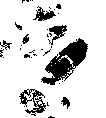
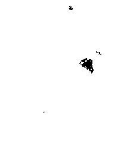
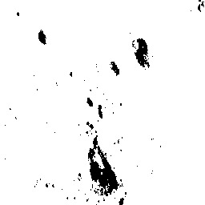
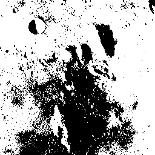
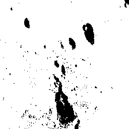
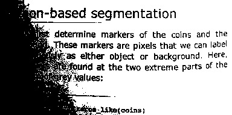
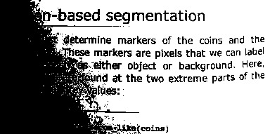
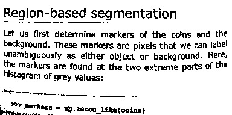

# ImageBinarization.jl Documentation

A Julia package containing a number of algorithms for analyzing images and automatically binarizing them into background and foreground.

```@contents
Depth = 2
```

## Basic usage

Each binarization algorithm in `ImageBinarization.jl` is an [`AbstractImageBinarizationAlgorithm`](@ref ImageBinarization.BinarizationAPI.AbstractImageBinarizationAlgorithm).

Suppose one wants to binarize an image. This can be achieved by simply choosing
an appropriate algorithm and calling [`binarize`](@ref) or [`binarize!`](@ref) in the
image. The background and foreground will be automatically binarized.

Let's see a simple demo:

```@example
using TestImages, ImageBinarization, FileIO # hide
img = testimage("cameraman")
alg = Otsu()
img₀₁ = binarize(img, alg)
save("images/demo.jpg", hcat(img, img₀₁)) # hide
```

```@raw html

```

This usage reads as "`binarize` the image `img` with algorithm `alg`"

For more advanced usage, please check [function reference](@ref function_reference) page.

## Examples of ImageBinarization in action

```@raw html
<h>Image of cells:</h>
<table width="500" border="0" cellpadding="5">

<tr>
<td align="center" valign="center">

<br />
Original image
</td>
</tr>

<tr>
<td align="center" valign="center">

<br />
Intermodes
</td>

<td align="center" valign="center">

<br />
Minimum Error
</td>

<td align="center" valign="center">

<br />
Minimum
</td>
</tr>

<tr>
<td align="center" valign="center">

<br />
Moments
</td>

<td align="center" valign="center">

<br />
Otsu
</td>

<td align="center" valign="center">

<br />
Polysegment
</td>
</tr>

<tr>
<td align="center" valign="center">

<br />
Rosin
</td>

<td align="center" valign="center">

<br />
Sauvola
</td>

<td align="center" valign="center">

<br />
Niblack
</td>
</tr>

<tr>
<td align="center" valign="center">

<br />
Adaptive
</td>

<td align="center" valign="center">

<br />
Yen
</td>

<td align="center" valign="center">

<br />
Balanced
</td>
</tr>
</table>

<h>Image of moon surface: (Unimodal)</h>
<table width="500" border="0" cellpadding="5">

<tr>
<td align="center" valign="center">

<br />
Original image
</td>
</tr>

<tr>
<td align="center" valign="center">

<br />
Intermodes
</td>

<td align="center" valign="center">

<br />
Minimum Error
</td>

<td align="center" valign="center">

<br />
Minimum
</td>
</tr>

<tr>
<td align="center" valign="center">

<br />
Moments
</td>

<td align="center" valign="center">

<br />
Otsu
</td>

<td align="center" valign="center">

<br />
Polysegment
</td>
</tr>

<tr>
<td align="center" valign="center">

<br />
Rosin
</td>

<td align="center" valign="center">

<br />
Sauvola
</td>

<td align="center" valign="center">

<br />
Niblack
</td>
</tr>

<tr>
<td align="center" valign="center">

<br />
Adaptive
</td>

<td align="center" valign="center">

<br />
Yen
</td>

<td align="center" valign="center">

<br />
Balanced
</td>
</tr>
</table>

<h>Image of text:</h>
<table width="500" border="0" cellpadding="5">

<tr>
<td align="center" valign="center">

<br />
Original image
</td>
</tr>

<tr>
<td align="center" valign="center">

<br />
Intermodes
</td>

<td align="center" valign="center">

<br />
Minimum Error
</td>

<td align="center" valign="center">

<br />
Minimum
</td>
</tr>

<tr>
<td align="center" valign="center">

<br />
Moments
</td>

<td align="center" valign="center">

<br />
Otsu
</td>

<td align="center" valign="center">

<br />
Polysegment
</td>
</tr>

<tr>
<td align="center" valign="center">

<br />
Rosin
</td>

<td align="center" valign="center">

<br />
Sauvola
</td>

<td align="center" valign="center">

<br />
Niblack
</td>
</tr>

<tr>
<td align="center" valign="center">

<br />
Adaptive
</td>

<td align="center" valign="center">

<br />
Yen
</td>

<td align="center" valign="center">

<br />
Balanced
</td>
</tr>
</table>
```
